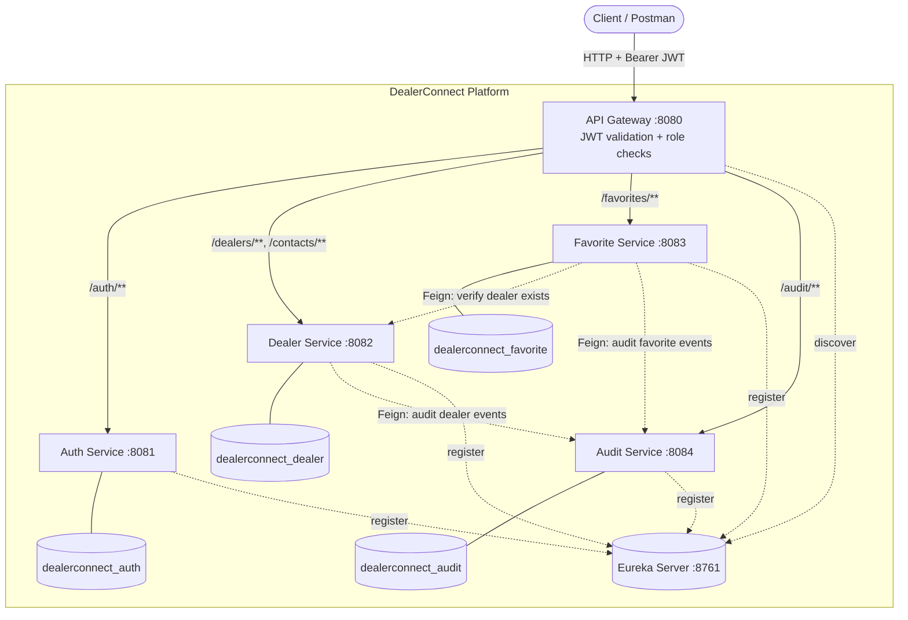
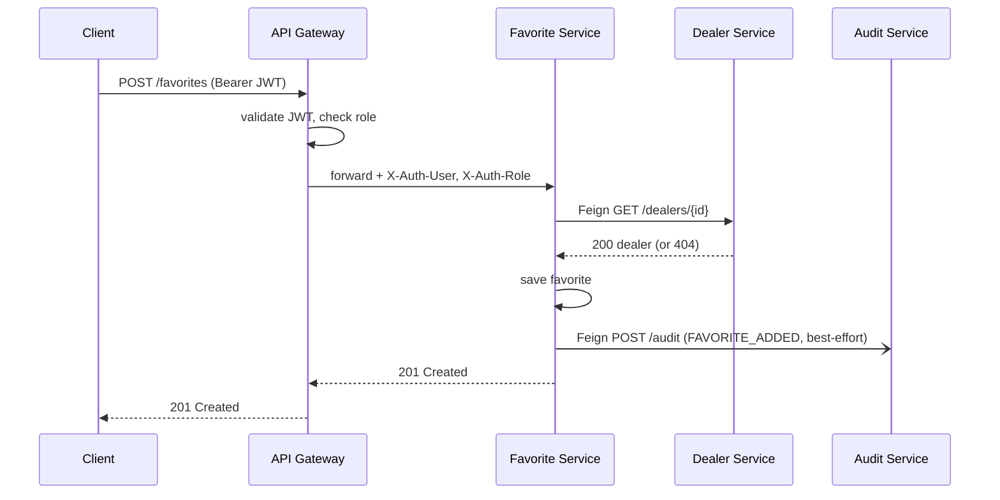

# DealerConnect — Architecture

DealerConnect is a microservice platform for dealer relationship management with
centralized authentication, role-based authorization, service discovery, inter-service
communication, and a full audit trail.

## Technology stack

- Java 21, Spring Boot 4.1
- Spring Cloud 2025.1 (Netflix Eureka, Spring Cloud Gateway 5, OpenFeign)
- Spring Security, JWT (jjwt, HS512)
- Spring Data JPA, MySQL 8
- Lombok, Maven

## Services and ports

| Service | Eureka name | Port | Database | Responsibility |
|---------|-------------|------|----------|----------------|
| Eureka Server | EUREKA-SERVER | 8761 | – | Service registry |
| API Gateway | API-GATEWAY | 8080 | – | Routing, JWT validation, role authorization |
| Auth Service | AUTH-SERVICE | 8081 | dealerconnect_auth | Registration, login, JWT issuing |
| Dealer Service | DEALER-SERVICE | 8082 | dealerconnect_dealer | Dealer & contact management |
| Favorite Service | FAVORITE-SERVICE | 8083 | dealerconnect_favorite | Dealer favorites |
| Audit Service | AUDIT-SERVICE | 8084 | dealerconnect_audit | Audit history |

## Component diagram



Solid arrows are gateway-routed client traffic; dotted arrows are service-to-service
calls (Feign) and Eureka registration/discovery.

## Security model

Authentication is centralized at the API Gateway. Downstream services do not validate
JWTs themselves; they trust requests forwarded by the gateway.

1. A client calls `POST /auth/login` (public). The Auth Service verifies the BCrypt
   password and returns a signed JWT (HS512) whose subject is the email and which carries
   a `role` claim.
2. For every other route the gateway requires `Authorization: Bearer <token>`, validates
   the signature and expiry, and checks the role against the route rules below.
3. On success the gateway injects `X-Auth-User` and `X-Auth-Role` headers and forwards the
   request. Services read `X-Auth-User` (for example to scope favorites and to stamp the
   `performedBy` field on audit records).

The JWT signing secret is shared between the Auth Service (signing) and the API Gateway
(validation).

### Route authorization rules (enforced at the gateway)

| Route | Method | Allowed role |
|-------|--------|--------------|
| `/auth/login`, `/auth/register` | any | public (no token) |
| `/dealers/**`, `/contacts/**` | GET | ADMIN, RELATIONSHIP_MANAGER |
| `/dealers/**`, `/contacts/**` | POST/PUT/PATCH/DELETE | ADMIN |
| `/favorites/**` | any | ADMIN, RELATIONSHIP_MANAGER |
| `/audit/**` | any | ADMIN |

## Inter-service communication (OpenFeign)

- **Favorite Service → Dealer Service**: before creating a favorite, the Favorite Service
  calls `GET /dealers/{id}` to confirm the dealer exists. A 404 from the Dealer Service
  becomes a 404 from the Favorite Service.
- **Dealer Service → Audit Service** and **Favorite Service → Audit Service**: business
  events are posted to `POST /audit`. Audit publishing is best-effort — a failure is logged
  but never fails or rolls back the originating operation.

Feign calls go service-to-service via Eureka load balancing and do not pass through the
gateway, so they are not subject to the gateway's JWT checks.

## Layered architecture (per service)

```
controller  ->  service  ->  repository  ->  entity (JPA)
     |             |
   dto         client (Feign)        exception (global handler + custom exceptions)
```

- **controller** — REST endpoints, request validation, HTTP status mapping.
- **service** — business logic and transactions.
- **repository** — Spring Data JPA persistence.
- **dto** — request/response payloads (entities are never exposed directly).
- **client** — Feign interfaces for inter-service calls.
- **exception** — `@RestControllerAdvice` global handler plus domain exceptions.

## Request flow example — adding a favorite


