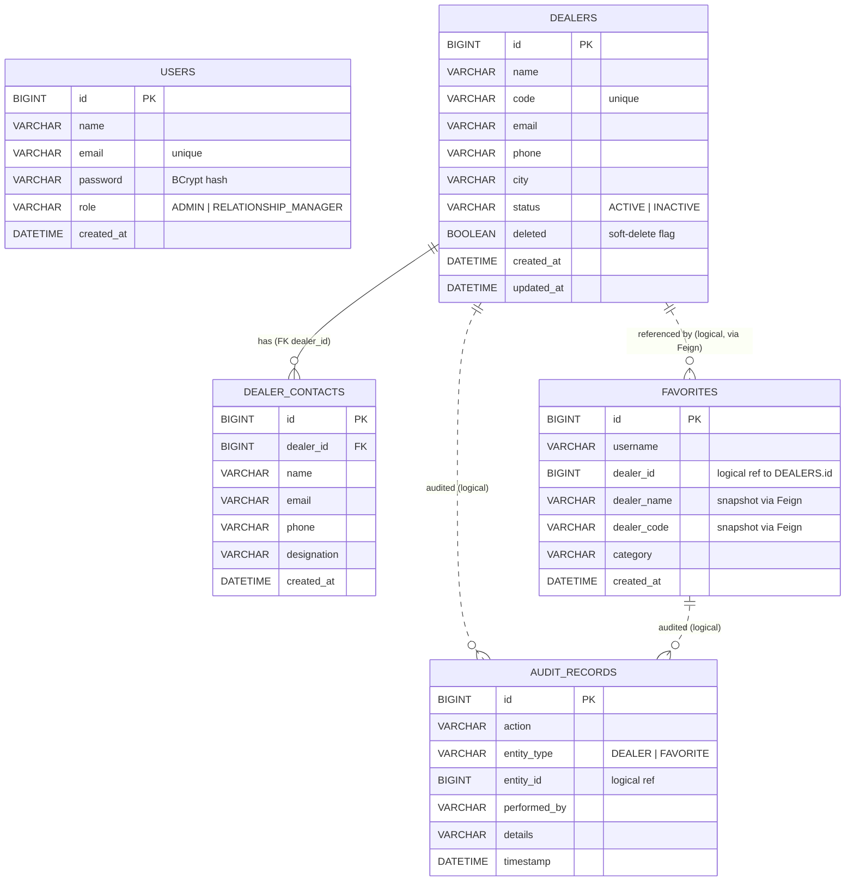

# DealerConnect — Entity Relationship Diagram

Each microservice owns a separate MySQL database (database-per-service). There are no
cross-database foreign keys; references that span services (for example a favorite
pointing at a dealer) are **logical** references resolved at runtime through OpenFeign.

## Databases and tables

| Database | Owning service | Tables |
|----------|----------------|--------|
| `dealerconnect_auth` | auth-service | `users` |
| `dealerconnect_dealer` | dealer-service | `dealers`, `dealer_contacts` |
| `dealerconnect_favorite` | favorite-service | `favorites` |
| `dealerconnect_audit` | audit-service | `audit_records` |

## Diagram

Legend: solid line `||--o{` is a real foreign key within a single database; dotted line
`||..o{` is a logical, cross-service reference (no database-level foreign key).

## Relationships

- **DEALERS 1 — N DEALER_CONTACTS**: a dealer has many contacts. Real foreign key
  `dealer_contacts.dealer_id → dealers.id` (same database).
- **FAVORITES → DEALERS**: each favorite stores a `dealer_id`. The dealer lives in a
  different database, so existence is verified through the Dealer Service (Feign) before a
  favorite is created; the dealer name/code are snapshotted onto the favorite at that time.
- **AUDIT_RECORDS → DEALERS / FAVORITES**: each audit row stores `entity_type` and
  `entity_id` identifying the audited record. This is a logical reference only.

## Uniqueness and constraints

- `users.email` — unique.
- `dealers.code` — unique among non-deleted dealers (enforced in the service layer).
- `favorites (username, dealer_id)` — unique composite (a user cannot favorite the same
  dealer twice).
